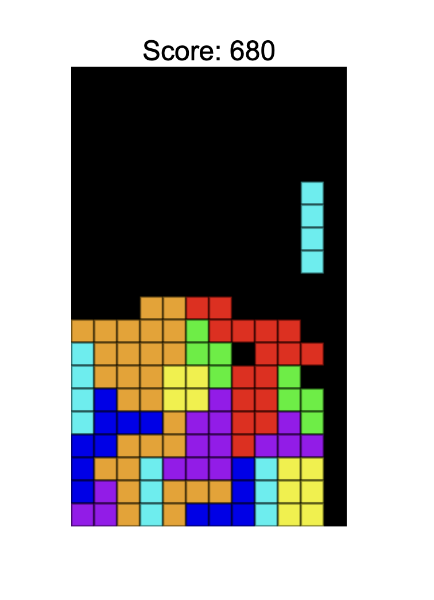
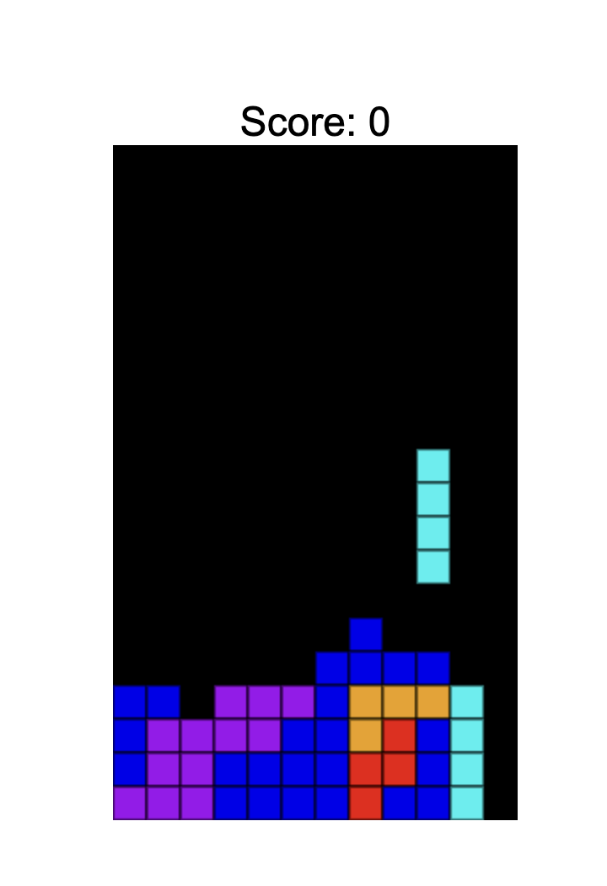

# Tetris

### Description

This application is just a remake of a very popular game called tetris.
Haven't heard of it? Interesting... here are the rules

#### Rules:

- Place piece by touching the piece to the floor or on top of another piece
- Pieces will slowly fall and are randomly selected
- A full row of blocks will get convert the row into points
- The more rows you remove at once, the greater the points awarded
- If a piece is placed at the top, Game Over!

#### Controls:

- Move Left: A or Left Arrow
- Move Right: D or Right Arrow
- Move Down: S or Down Arrow
- Rotate Left: Q or Left Shift
- Rotate Right: E or Right Shift

### Technologies

- HTML5
- CSS
- Javascript

### GitHub

Link to GitHub Repo: https://github.com/Bugsie71/Projects-Tetris.git

### Screenshots

	

